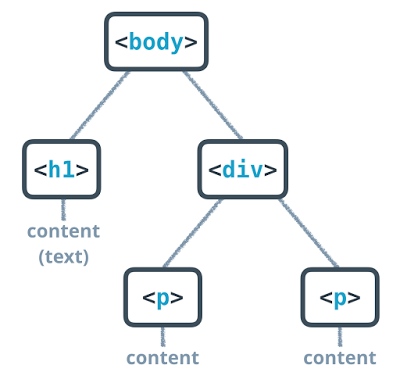

# Udacity/Grow with Google - Front End Web Dev Project: Mockup to Article

#### Ctrl-clicking (Command-click for Mac users) the links below will open them in a new browser tab

In January 2018 I received a [Grow with Google Challenge Scholarship](https://www.udacity.com/grow-with-google) to the Front-End Web Developer track of [Udacity.com](https://www.udacity.com).

While I already have plenty of experience coding in HTML I am still going through this program in order to earn a scholarship to [Udacity's Front-End Developer Nanodegree](https://www.udacity.com/course/front-end-web-developer-nanodegree--nd001). My goal with that program is to improve my JavaScript and React development skills and to progress towards a career as a Software developer.

---

I've learned a lot about web development so far. Here are my thoughts about web development from this project:
  * __What new skills have you learned?__ I learned about the [Mozilla Developer Network (MDN) HTML element Reference](https://developer.mozilla.org/en-US/docs/Web/HTML/Element). From there I learned how to use the [&lt;figure&gt; element](https://developer.mozilla.org/en-US/docs/Web/HTML/Element/figure) when captioning images.
  * __What has been easy?__ Everything. I'm very comfortable with all of this stuff.
  * __What has been difficult?__ Getting in the habit of coding for an hour or two every night.
  * __How have you used the problem solving strategies from the first project to overcome challenges so far?__ The analogy of trees and HTML is very helpful when solving problems. Understanding the parent-child relationship definitely helps overcome challenges.

